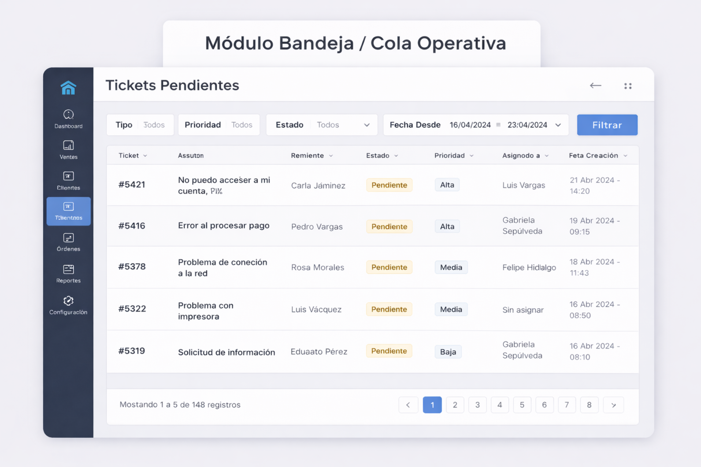
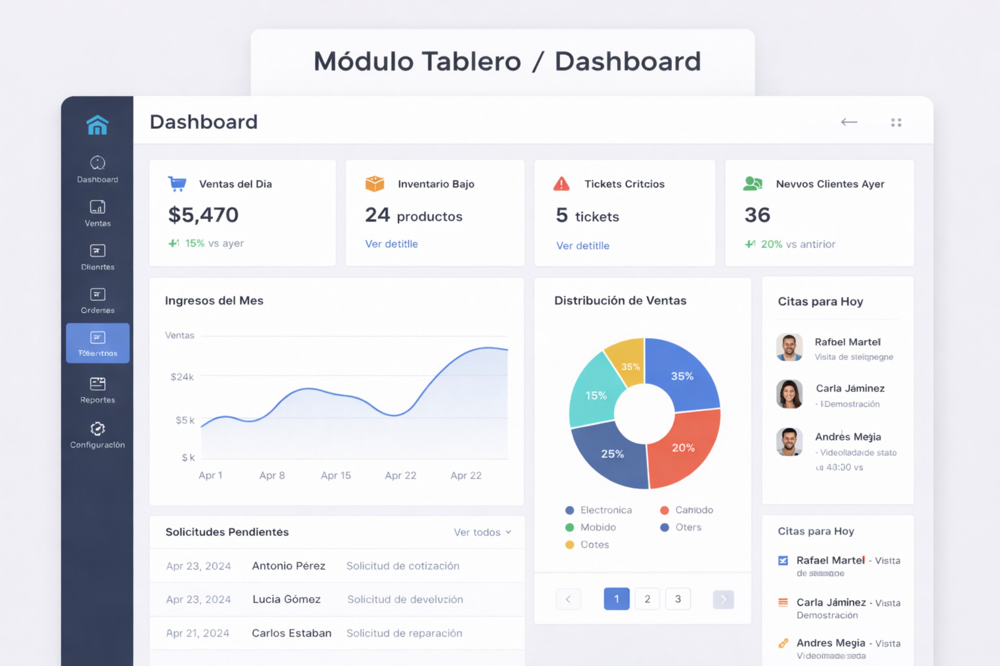

# Tipos de módulos y preguntas

## Propósito

Este documento sirve para clasificar módulos de un sistema administrativo sin improvisar. La idea no es preguntar al cliente "qué pantalla quiere", sino detectar qué naturaleza tiene cada parte del negocio.

## Regla base

Una entidad o proceso puede atravesar varios tipos de módulo. Por ejemplo, una orden de reparación puede nacer en un wizard, vivir como expediente, aparecer en bandeja, generar documentos y terminar impactando reportes.

---

## 1. Catálogo / CRUD

### Qué problema resuelve
Administrar registros relativamente estables del negocio.

### Preguntas clave
- ¿Esto es una lista de cosas que ustedes crean, consultan y editan?
- ¿Se busca, filtra y ordena frecuentemente?
- ¿Se activa o inactiva, en vez de borrarse?
- ¿Sirve como base para otros procesos?

### Señales de que sí aplica
- entidad estable
- lista maestra
- edición puntual
- uso recurrente como referencia

### JavaFX típico
- `BorderPane`
- `TableView`
- filtros arriba con `TextField`, `ComboBox`, `DatePicker`
- formulario modal o panel aparte

---

## 2. Wizard / flujo guiado

### Qué problema resuelve
Guiar una operación por pasos cuando el orden importa.

### Preguntas clave
- ¿Esta tarea se hace siguiendo una secuencia clara?
- ¿Un dato depende del paso anterior?
- ¿Conviene dividirlo en etapas para evitar errores?
- ¿Hay resumen final antes de confirmar?

### Señales de que sí aplica
- pasos
- validación por etapa
- contexto acumulado
- navegación siguiente / anterior

### JavaFX típico
- `BorderPane`
- `StackPane` o intercambio de vistas
- progreso arriba
- navegación abajo
- un contexto compartido entre pasos

---

## 3. Expediente / caso vivo

### Qué problema resuelve
Gestionar una entidad que vive en el tiempo y cambia de estado.

### Preguntas clave
- ¿Este registro se sigue durante días, semanas o meses?
- ¿Tiene historial, comentarios o adjuntos?
- ¿Cambia de estado varias veces?
- ¿Varias personas lo tocan a lo largo del tiempo?

### Señales de que sí aplica
- ciclo de vida
- trazabilidad
- acciones según estado
- necesidad de historial

### JavaFX típico
- `BorderPane` o `SplitPane`
- cabecera con resumen del caso
- `TabPane` para historial, comentarios, adjuntos y auditoría

---

## 4. Bandeja / cola operativa

### Qué problema resuelve
Atender pendientes de trabajo.

### Preguntas clave
- ¿Los usuarios trabajan desde una lista de cosas pendientes?
- ¿Hay prioridad, asignación o urgencia?
- ¿Importa ver qué está vencido o qué falta resolver?
- ¿Se necesita actuar rápido desde la lista?

### Señales de que sí aplica
- pendientes
- filtros por estado, fecha o responsable
- priorización
- acciones rápidas

### JavaFX típico
- `SplitPane`
- `TableView` o `ListView` a la izquierda
- detalle o preview a la derecha
- filtros arriba

---

## 5. Dashboard / tablero

### Qué problema resuelve
Dar una visión rápida del estado del negocio.

### Preguntas clave
- ¿Qué indicadores necesitan ver apenas entran?
- ¿Qué alertas deberían saltar a la vista?
- ¿Qué métricas resumen la operación?
- ¿Qué accesos rápidos conviene mostrar?

### Señales de que sí aplica
- KPIs
- alertas
- monitoreo rápido
- resumen ejecutivo u operativo

### JavaFX típico
- `ScrollPane`
- `VBox`, `HBox`, `TilePane`
- gráficos y tarjetas KPI
- tablas breves de alertas o actividad reciente

---

## 6. Configuración / parametrización

### Qué problema resuelve
Permitir cambiar parámetros del sistema sin tocar código.

### Preguntas clave
- ¿Qué valores o reglas cambian con el tiempo?
- ¿Qué deberían poder ajustar ustedes mismos?
- ¿Qué configuraciones son globales?
- ¿Quién puede modificarlas?

### Señales de que sí aplica
- parámetros operativos
- políticas
- catálogos técnicos
- configuración sensible

### JavaFX típico
- `TabPane` o `SplitPane`
- formularios con `GridPane`
- `CheckBox`, `ComboBox`, `Spinner`, `TextField`

---

## 7. Aprobación / revisión

### Qué problema resuelve
Controlar decisiones humanas que habilitan o frenan una acción.

### Preguntas clave
- ¿Hay algo que no se ejecuta hasta que alguien lo revise?
- ¿Quién aprueba y quién solicita?
- ¿Puede aprobarse, rechazarse o devolverse?
- ¿Hace falta dejar observaciones?

### Señales de que sí aplica
- gate de decisión
- separación entre quien solicita y quien autoriza
- historial de aprobación

### JavaFX típico
- `SplitPane`
- solicitudes a un lado
- detalle al otro
- `TextArea` para observaciones
- botones aprobar / rechazar / devolver

---

## 8. Reportes / informes

### Qué problema resuelve
Resumir, consultar y exportar información.

### Preguntas clave
- ¿Qué reportes necesitan sacar?
- ¿Qué filtros requieren?
- ¿Qué exportan?
- ¿Qué decisiones toman a partir de esos resultados?

### Señales de que sí aplica
- consolidación de información
- exportación
- enfoque analítico o de control

### JavaFX típico
- filtros arriba
- resultados en `TableView` o gráficos
- botones de exportación

---

## 9. Hub de acceso / navegación

### Qué problema resuelve
Organizar una familia de funciones en una pantalla índice clara.

### Preguntas clave
- ¿Conviene una pantalla de entrada a esta sección?
- ¿Hay muchas funciones relacionadas?
- ¿El usuario entra primero a decidir qué hacer?
- ¿Diferentes roles deberían ver accesos distintos?

### Señales de que sí aplica
- agrupación funcional
- tarjetas o accesos rápidos
- capa extra de navegación con sentido

### JavaFX típico
- `ScrollPane`
- `TilePane`, `FlowPane` o `GridPane`
- tarjetas o bloques de acceso

---

## 10. Transaccional

### Qué problema resuelve
Registrar una operación con consecuencias reales en dinero, stock, estados o comprobantes.

### Preguntas clave
- ¿Esto mueve dinero, stock o un estado importante?
- ¿Qué pasa si se registra dos veces?
- ¿Se puede anular?
- ¿Qué validaciones son críticas antes de confirmar?

### Señales de que sí aplica
- operación sensible
- riesgo de inconsistencia
- confirmación fuerte

### JavaFX típico
- formulario + detalle + resumen
- totales visibles
- confirmación final con `Alert` o `Dialog`

---

## 11. Búsqueda / consulta especializada

### Qué problema resuelve
Encontrar bien información compleja cuando una tabla simple no basta.

### Preguntas clave
- ¿Hay muchas formas de buscar esto?
- ¿Se combinan varios criterios?
- ¿Se consulta más de lo que se edita?
- ¿Hace falta abrir detalle desde los resultados?

### Señales de que sí aplica
- muchos filtros
- volumen histórico
- exploración de resultados

### JavaFX típico
- filtros arriba o a la izquierda
- `TableView` de resultados
- `SplitPane` opcional con detalle

---

## 12. Comunicación / soporte

### Qué problema resuelve
Registrar conversaciones o mensajes útiles alrededor de un caso o interacción.

### Preguntas clave
- ¿Hace falta guardar comentarios o mensajes?
- ¿La conversación acompaña un ticket, una orden o un caso?
- ¿Hay mensajes internos y externos?
- ¿Importa el historial?

### Señales de que sí aplica
- conversación relevante
- seguimiento comunicacional
- contexto de soporte

### JavaFX típico
- `SplitPane`
- lista de conversaciones
- hilo de mensajes
- caja de redacción abajo

---

## 13. Documental

### Qué problema resuelve
Gestionar documentos o evidencias del proceso.

### Preguntas clave
- ¿Qué documentos se generan o se reciben?
- ¿Se necesita imprimir, exportar o adjuntar?
- ¿Hay vista previa?
- ¿El documento tiene valor legal u operativo?

### Señales de que sí aplica
- comprobantes
- contratos
- órdenes
- adjuntos o fotos relevantes

### JavaFX típico
- lista de documentos en `TableView` o `ListView`
- panel de metadatos o preview
- acciones de generar, descargar o imprimir

---

## 14. Agenda / calendario

### Qué problema resuelve
Organizar citas, reservas, turnos o programación temporal.

### Preguntas clave
- ¿Aquí lo importante es programar cosas en fecha y hora?
- ¿Hay conflictos de disponibilidad?
- ¿Hace falta ver el tiempo como agenda, no solo como fecha?
- ¿Se reprograma?

### Señales de que sí aplica
- turnos
- citas
- reservas
- recursos asignados por hora

### JavaFX típico
- `DatePicker`
- grilla temporal con `GridPane` o lista/tabla por fecha
- detalle del evento seleccionado

## Galería visual relacionada

Para una referencia visual rápida de varios tipos de módulo, ver:

- [Galería visual de módulos](../05_diseno_del_sistema_administrativo/13_galeria_visual_de_modulos.md)

### Referencias visuales directas

#### Catálogo / CRUD

#### Wizard / flujo guiado

#### Expediente / caso vivo

#### Bandeja / cola operativa

#### Dashboard / tablero

