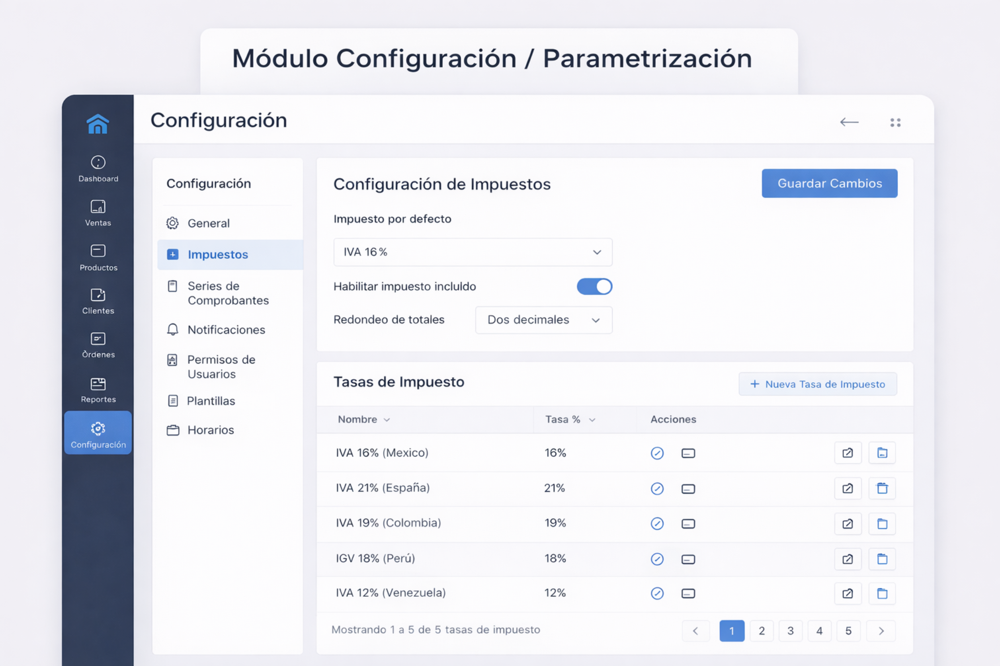
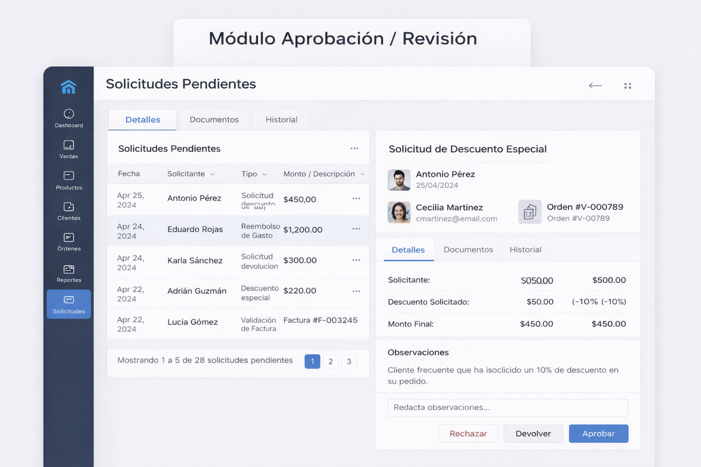
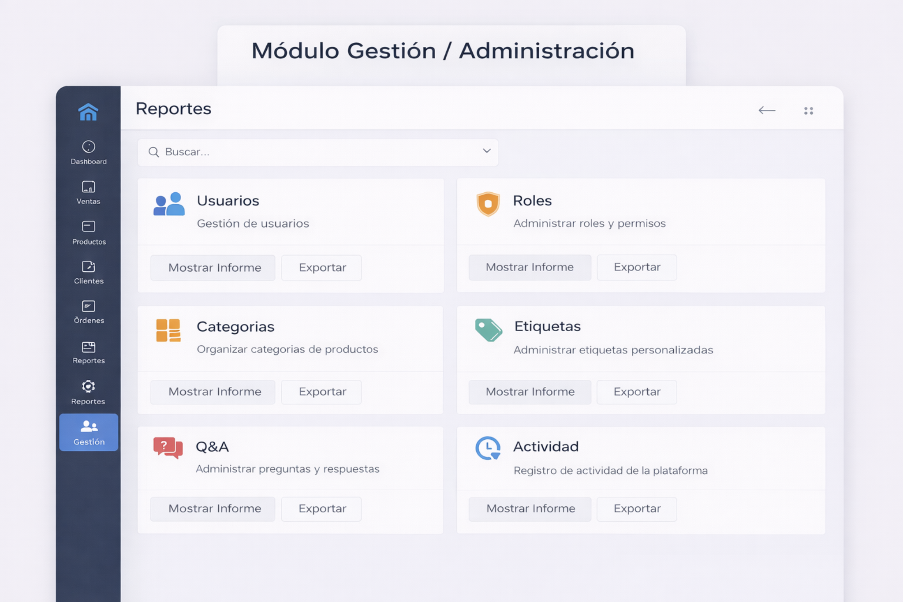
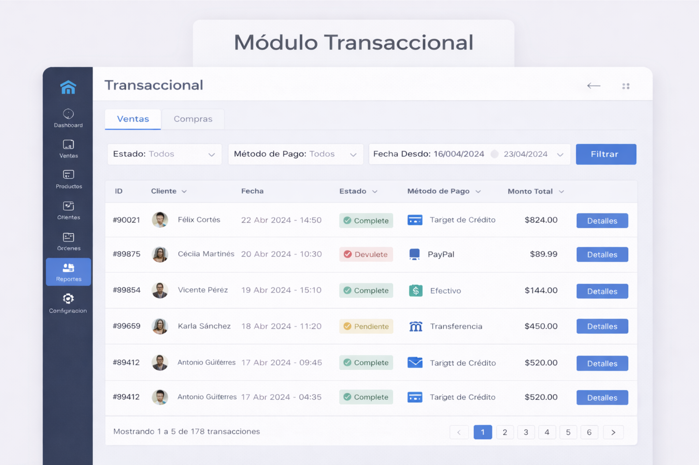

# Galería visual de tipos de módulo

Este documento reúne referencias visuales de varios tipos de módulo para que la biblioteca no se quede solo en teoría. Las imágenes son representaciones rápidas de patrones administrativos, no diseños finales de producto.

## Navegación / Hub de acceso

## Catálogo / CRUD

## Wizard / flujo guiado

## Expediente / caso vivo

## Bandeja / cola operativa

## Dashboard / tablero

## Configuración / parametrización

## Aprobación / revisión

## Reportes / informes

## Gestión / administración

## Transaccional

## Búsqueda / consulta especializada

## Comunicación / soporte

## Documental

## Observación

Todavía no hay una referencia visual dedicada para agenda / calendario. Cuando exista, conviene añadirla a esta galería y enlazarla también desde los documentos de interacción y JavaFX.
