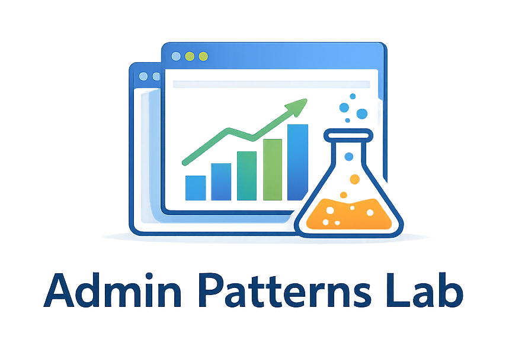
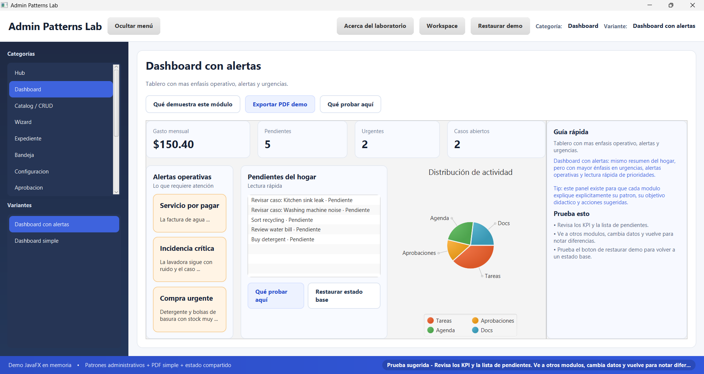

# Diseño de aplicaciones administrativas full stack

Una biblioteca personal de criterio, método y documentación para aprender a moverse con más claridad en el desarrollo freelance de software administrativo.

> Captura del laboratorio JavaFX incluido en este repositorio. No es un producto final para clientes, sino un laboratorio didáctico para practicar patrones administrativos, variantes de módulos y decisiones de interacción.

## Qué tesis manda en este repositorio

Este repositorio gira alrededor de una idea principal:

**el negocio manda, la arquitectura obedece.**

Eso implica varias cosas al mismo tiempo.

Primero, una aplicación administrativa no debe diseñarse desde la moda técnica, sino desde el dolor operativo, los flujos reales, las reglas del negocio y el nivel de complejidad que el cliente ya tiene encima.

Segundo, un MVP o una V1 no tienen que verse como una caricatura técnica ni como un castillo de capas vacías. Tienen que ser una primera versión defendible, usable, cobrable y lo bastante simple como para evolucionar sin ahogarte.

Tercero, la complejidad arquitectónica no desaparece para siempre, pero debe entrar cuando el problema real la justifique: más usuarios, más módulos, más riesgo, más integraciones, más auditoría, más despliegues o más equipos tocando el sistema.

## Para quién es esta biblioteca

Este repositorio está pensado sobre todo para alguien que:

- trabaja o quiere trabajar como freelance construyendo software administrativo;
- necesita dejar de improvisar reuniones, levantamientos, alcances y primeras versiones;
- quiere traducir mejor negocio → datos → backend → interacción;
- quiere construir con criterio sin caer en sobreingeniería ornamental;
- quiere usar IA como amplificador de productividad, no como sustituto del juicio técnico.

También puede servir como biblioteca privada de referencia para quien ya tiene proyectos hechos y quiere ordenarlos mejor mentalmente.

## Qué problema intenta resolver

Muchos desarrolladores saben programar, pero se sienten menos firmes cuando aparece el trabajo real con un negocio:

- qué preguntar en una reunión;
- cómo descubrir flujos y reglas;
- cómo detectar entidades y relaciones;
- cómo decidir qué módulo conviene;
- cómo cortar un MVP sin regalar trabajo;
- cómo pasar del negocio al backend y a la base de datos;
- cómo explicar fases al cliente sin sonar vendedor de humo;
- cómo mantener y evolucionar un sistema sin sobreingeniería ornamental.

Esta biblioteca existe para convertir esas zonas grises en un mapa de trabajo más explícito.

## Qué te llevas si la recorres bien

Si la usas de verdad, esta biblioteca intenta ayudarte a:

- escuchar mejor al cliente;
- levantar información con más orden;
- modelar mejor el negocio;
- diseñar una base de datos suficiente y evolutiva;
- estructurar backend con criterio de madurez;
- decidir mejor qué entra en un MVP o una V1;
- cobrar con menos miedo una primera fase defendible;
- detectar cuándo sí conviene endurecer arquitectura;
- evolucionar el software como producto y no como parche infinito.

## Cómo leer este repositorio

La lectura correcta no es lineal ni académica. Este repositorio está organizado como una cadena de traducción:

1. entender el negocio;
2. levantar información con orden;
3. modelar entidades, procesos, flujos, estados y reglas;
4. traducir eso a datos, backend y módulos de interacción;
5. decidir qué sí entra en una primera versión y qué no;
6. desplegar, mantener y evolucionar la solución con criterio.

## Niveles de madurez que atraviesan la biblioteca

Muchos documentos de este repositorio deben leerse con esta escala mental.

### Nivel 1. MVP o V1 inicial
- monolito modular;
- pocas capas útiles;
- flujo central completo;
- seguridad y trazabilidad mínimas pero reales;
- cero adornos innecesarios.

### Nivel 2. Sistema ya usado
- más claridad modular;
- más trazabilidad;
- más reportes;
- más disciplina de despliegue y mantenimiento;
- primeras decisiones de endurecimiento técnico.

### Nivel 3. Sistema realmente complejo
- fronteras más fuertes;
- más infraestructura;
- decisiones más serias de seguridad, integración, observabilidad o separación;
- arquitectura más pesada solo si el negocio ya la exige.

## Filosofía práctica

Este repositorio favorece:

- operatividad antes que extravagancia;
- claridad antes que adornos;
- modularidad razonable antes que ceremonias vacías;
- abstracciones donde hay cambio real, no por ansiedad;
- pocas dependencias, bien elegidas;
- documentación viva y versionable;
- apoyo de IA con criterio humano;
- evolución del software basada en uso real.

## Qué no defiende este repositorio

No defiende:

- arquitectura fancy por ego;
- capas vacías por si acaso;
- interfaces para todo porque sí;
- adaptadores donde no hay frontera real;
- repositorios madre innecesarios para CRUDs triviales;
- microservicios como reflejo automático de profesionalismo.

La tesis es más sobria:

**primero validar, ordenar, cobrar y aprender; después endurecer donde duele.**

## Qué contiene el repositorio

### 00_norte_y_criterio
La tesis general del repositorio, principios de trabajo y forma de hablar con clientes.

### 01_levantamiento_de_informacion
Cómo preguntar, cómo descubrir flujos, cómo orientar al cliente y cómo evitar respuestas vacías.

### 02_modelado_del_negocio
La traducción del negocio a entidades, procesos, estados, reglas y excepciones.

### 03_diseno_de_base_de_datos
Cómo pasar del negocio al modelo conceptual, lógico y físico, y cómo pensar la evolución del esquema.

### 04_diseno_del_backend
Backend serio, pero subordinado al nivel de madurez del sistema. No arquitectura pesada por defecto.

### 05_diseno_del_sistema_administrativo
Patrones de módulo, interacción, desktop JavaFX, diseño web administrativo y relación entre pantallas.

### 06_relacion_con_cliente
Cómo conducir conversaciones, negociar fases, manejar objeciones y practicar casos simulados.

### 07_despliegue_e_infraestructura
Lo mínimo serio para poner a vivir un sistema sin fingir que tienes una plataforma planetaria.

### 08_mantenimiento_y_operacion
Soporte, trazabilidad, incidentes, deuda técnica y mantenimiento inteligente.

### 09_fundamentos_de_diseno_y_calidad
SOLID, acoplamiento, cohesión, malos olores, trade-offs, calidad y criterio técnico fino.

### 10_casos_aplicados
Casos sectoriales para aterrizar el marco en dominios concretos.

### 11, 12 y 13
Legal, normas y accesibilidad como criterios prácticos, no como burocracia decorativa.

### 14_laboratorio_javafx_minimo
Laboratorio conceptual del demo JavaFX.

### 15_demo_javafx_codigo
Código del laboratorio JavaFX con datos en memoria y variantes de módulos.

### 16, 17 y 18
MVP, uso de IA y evolución comercial del software. Estos bloques son el puente entre software, dinero, criterio y sostenibilidad freelance.

### 98_glosario y 99_plantillas
Vocabulario práctico y moldes reutilizables para que el trabajo se vuelva más repetible.

## Ruta rápida de lectura

Si vienes por primera vez a esta biblioteca, no necesitas leer todo en orden alfabético. Esta ruta ayuda a orientarte sin ahogarte.

### Ruta 1. Para pensar y vender mejor
1. `00_norte_y_criterio/00_mapa_general.md`
2. `16_mvp_mercado_y_validacion_comercial/01_que_es_un_mvp_en_software_administrativo.md`
3. `16_mvp_mercado_y_validacion_comercial/05_que_minimo_debo_ofrecer_para_cobrar_sin_miedo.md`
4. `06_relacion_con_cliente/01_metodologia_de_trabajo_con_clientes.md`
5. `18_evolucion_comercial_del_software/03_como_presentar_mejoras_sin_sonar_vendedor.md`

### Ruta 2. Para diseñar bien un sistema administrativo
1. `01_levantamiento_de_informacion/02_guia_de_descubrimiento_de_flujos.md`
2. `02_modelado_del_negocio/02_matriz_entidad_modulo_flujo_estado.md`
3. `03_diseno_de_base_de_datos/00_como_extraer_modelo_de_datos_desde_el_cliente.md`
4. `05_diseno_del_sistema_administrativo/01_tipos_de_modulo_como_patrones.md`
5. `05_diseno_del_sistema_administrativo/04_diseno_del_desktop_javafx.md`

### Ruta 3. Para endurecer criterio técnico sin sobreingeniería
1. `09_fundamentos_de_diseno_y_calidad/14_arquitectura_suficiente_y_sobreingenieria.md`
2. `04_diseno_del_backend/19_backend_suficiente_para_mvp_v1_y_sistema_maduro.md`
3. `03_diseno_de_base_de_datos/12_base_de_datos_suficiente_para_mvp_v1_y_evolucion.md`
4. `17_uso_de_ia_y_flujo_de_trabajo_aumentado/04_estrategia_hibrida_local_y_cloud.md`

### Ruta 4. Para operar con clientes sin improvisar
1. `06_relacion_con_cliente/02_etapas_de_conversacion_y_negociacion.md`
2. `06_relacion_con_cliente/10_como_orientar_al_cliente_para_obtener_buenas_respuestas.md`
3. `16_mvp_mercado_y_validacion_comercial/10_como_presentar_alcance_recortes_y_siguientes_fases.md`
4. `18_evolucion_comercial_del_software/10_checklist_para_proponer_una_mejora.md`

## Cómo usarlo de forma operativa

Una forma sana de usar este repositorio es esta:

- leer el bloque que necesites para pensar mejor;
- convertir esa lectura en checklist, plantilla o conversación real;
- aplicarlo a un caso concreto;
- volver a la biblioteca para ajustar criterio, no para memorizar teoría;
- usar el glosario y las plantillas como herramientas de apoyo diario.

Esta biblioteca no está pensada para leerse una sola vez y archivarse. Está pensada para acompañar proyectos, reuniones, levantamientos, decisiones y evoluciones.

## Qué no es este repositorio

No es:

- un framework oficial;
- una receta universal para todos los negocios;
- una excusa para meter arquitectura pesada;
- una garantía de éxito comercial por sí sola;
- un sustituto de revisar el contexto real del cliente.

Es una biblioteca de criterio y trabajo para reducir improvisación y aumentar claridad.

## Estado editorial de la biblioteca

Esta versión ya cubre lo esencial para trabajar con software administrativo desde una óptica freelance, con foco en criterio, modelado, producto, evolución y operación. Lo que queda después de esta versión ya es refinamiento opcional, más casos aplicados o más densidad por tema.

## Cómo leer los bloques

- Los bloques `00` a `06` te ayudan a entender negocio, cliente y diseño base.
- Los bloques `07` a `09` te ayudan a desplegar, mantener y decidir con mejor criterio técnico.
- Los bloques `16` a `18` te ayudan a moverte mejor en producto, mercado, IA y evolución comercial.
- `98_glosario` y `99_plantillas` son herramientas de apoyo diario.

## Licencia

Este repositorio incluye su archivo de licencia. Revisa `LICENSE` para ver los términos concretos de uso.
